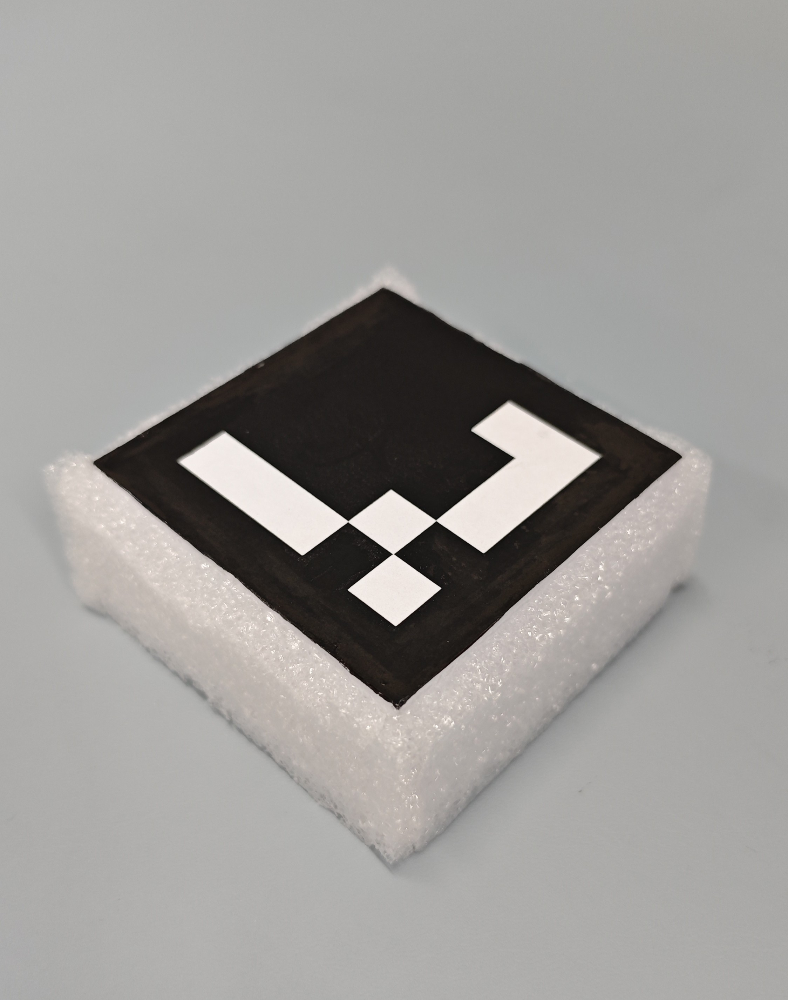

# 抓取测试

## 本项目使用 moveit 抓取 带有Aruco Tag 的物品测试

任务简介：使用相机定位抓取目标的位置，然后使用moveit进行抓取。

## 流程

1. 相机标定：

   1.1 内参标定：本项目使用realsence d435相机，带有内参自校正功能，无需标定；

   1.2 外参标定：使用[easy_handeye](https://github.com/IFL-CAMP/easy_handeye)

2. 制作[Aruco Tag](https://chev.me/arucogen/)：

   打印Aruco Tag，并将其贴在物体表面：

   

3. 抓取效果：

   
